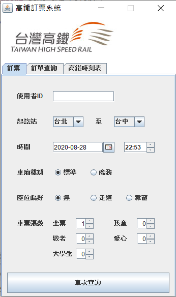

# OOAD Final Project 2019

    Course: Object-oriented Analysis and Design
    Final Project: THSR Booking System
    Team Member: Hsin-Yi Yang, Eva Lu, ChenTing Liao, Charlie Tsai

#### Environment

* OS: macOS
* MySQL 8.0 @ 127.0.0.1:3306
* JDK: 1.8.0
* IDE: Ecplise

#### Usage

* Import database

  ```mysql
  create database thsr;
  use thsr;
  source 20190114structure.sql;
  ```

* Use Eclipse to open the project.

* Run src/parser/TimeTableParser.java to parse the online time table.

* Run src/view/UIMainPage.java to start the application.


